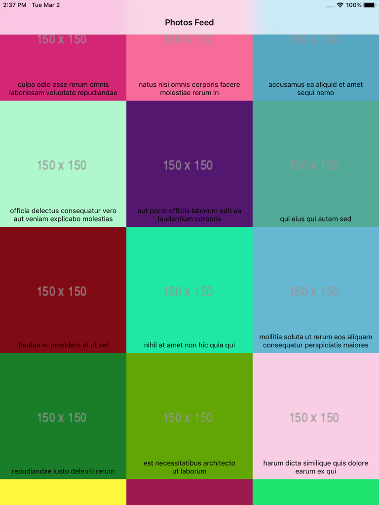
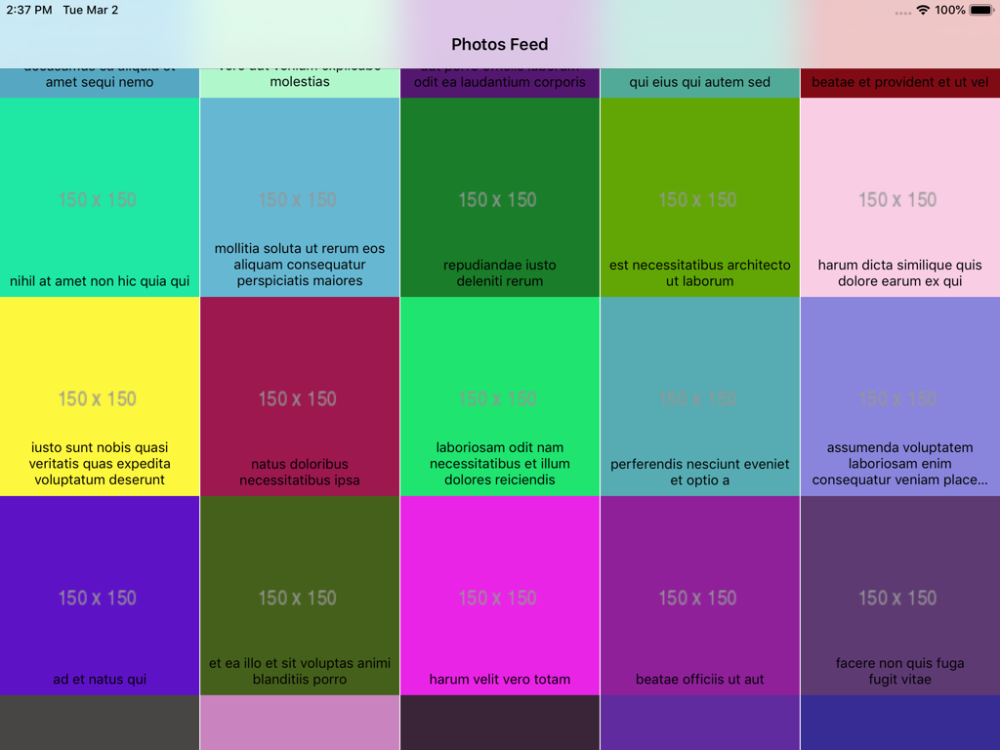
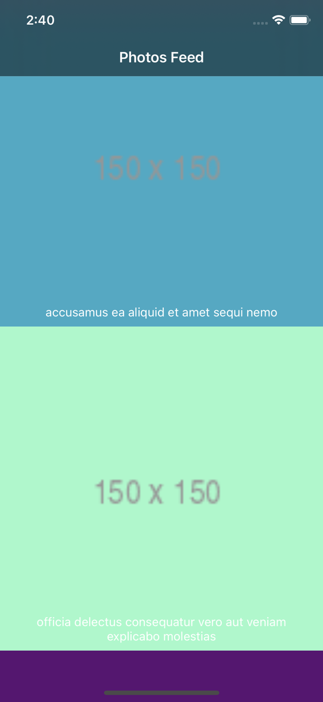
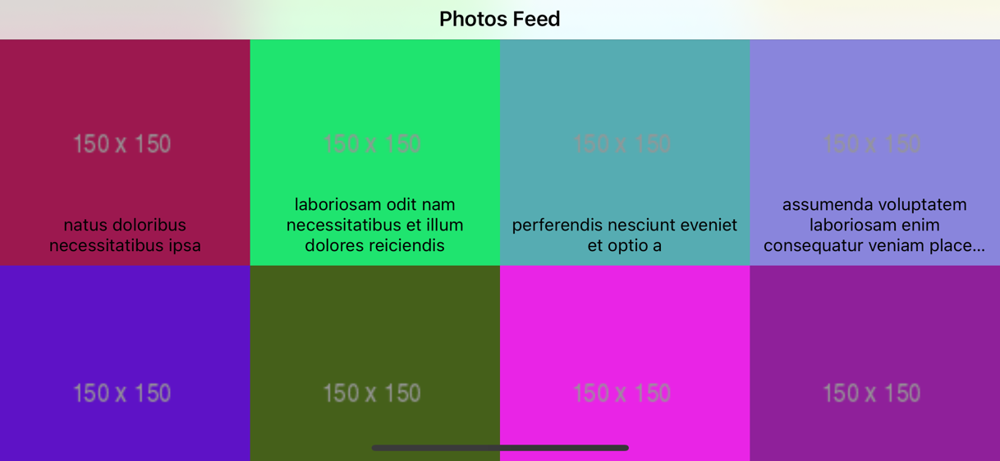
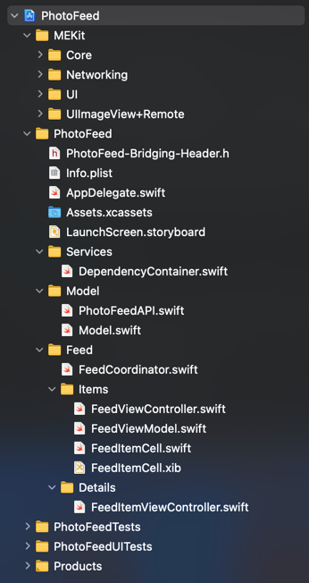

# Photo Feed

## General Implementation Notes

The app supports iPhone and iPad, also portrait and landscape modes.

It includes pull to refresh. 

It doesn't have pagination since the API end-point doesn't provide support for that.

Since iOS 11 must be supported, I didn't use some new frameworks like `Combine` or `CryptoKit`

The project is a git repository, you can see the history of changes by calling `git log`

There is no cache mechanism since that wasn't required. Images are cached.

Not third party code was used. I included some code that I usually reuase in my personal projects inside the folder `MEKit`

I didn't add any reactive capability since `Combine` can't be included. I could've included RxSwift, and use a `Driver` in the ViewModel, but I prefere to not include a whole third party dependency just for that.

I used `UICollectionView` with a custom layout, because it looks better when you want to represent diffent screen sizes, since you can present a grid when is appropiated.

I haven't used Storyboards mainly because in bigger projects that could be an issue. Those have poblems like: hard to code review, merge conflicts, etc.

## Architecture

Inside the folder `MEKit` you will find code that I usually reuse in my personal projects.

Then inside PhotoFeed you will see code that resolve current test.

I used `Coordinator` pattern to manage the navigation between `UIViewControllers`. Inspired by [Coordinators by Khanlou](https://khanlou.com/2015/10/coordinators-redux/)

`MVVM` to add a level of abstraction in the data presented by the `UIViewControllers`

To manage Dependecies Injection I used a Factory mechanism inspired from this article [Swift by Sundell](https://www.swiftbysundell.com/articles/dependency-injection-using-factories-in-swift)

## S.O.L.I.D.

Some S.O.L.I.D. principles were applyed in the solution:

+ Single Responsability Principle: components in general try to resolve as less as possible.

+ Open/Close Principle: The networking layer is a good example of this. It's closed for modifications, but open for extenion. If you want to implemenet a new end-point, you just have to provide an implementation of `APIService` protocol like `API.FetchPhotos` and pass that to `APIServiceProtocol` `load` func.

+ Dependency Inversion Principle: High level components don't depend on low level ones. Like in `FeedViewModel`, to fetch data, an `APIServiceProtocol` abstraciton was defined. This facilitates testing, since a `MockAPIService` that conforms `APIServiceProtocol` can be injected.

## Model

To fetch images I created a networking layer inspired a bit on this [Swift Talk videos](https://talk.objc.io/collections/networking) 

Model objects are decoded using `Decodable` 

## Images

Images are download and cached by an `UIImageView` extension created by me. This is part of the code that I usually reuse in different personal projects.

It creates a hash from the URL and stores that image in the file system inside Caches folder.

To download images, there is a queue that can handle up to 3 concurrent downloads.

If there is a cached image for some specific URL, that one will be presented.

## Unit Tests

I included a test for the `fetch` inside `FeedViewModel`. For that I created a `MockAPIService` that implements `APIServiceProtocol` by mapping a path with a local json.

More test can be included for the components inside `MEKit`.
